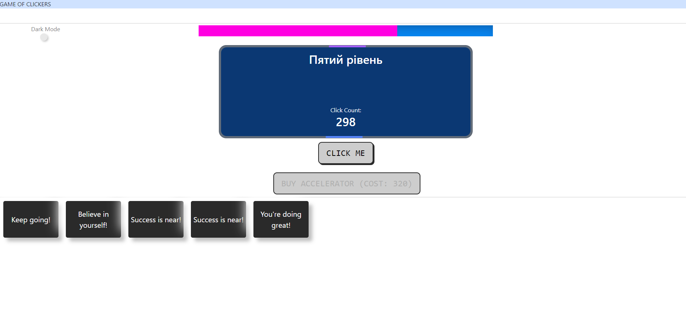
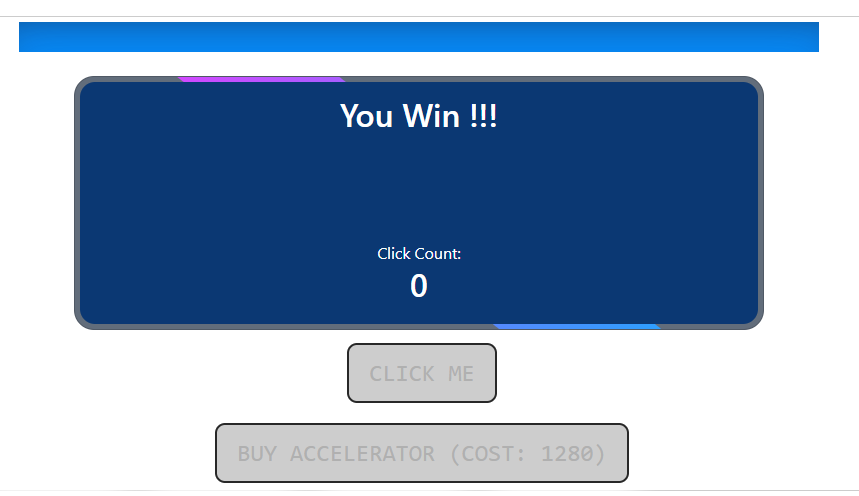

Welcome to Clicker Game!

+ An addictive and engaging game built with Angular.
Test your clicking skills and strive for high scores.
1. Gameplay:

+ Simple mechanics: Click the button to increase your click count.
Each click increases the progress bar and earns points.
+ Purchase accelerators to boost your progress.
Watch out for game over or win conditions.
2. Features:

+ Dark mode toggle for personalized gaming experience.
+ Random encouraging phrases to keep you motivated.
+ Sound effects for clicks and level advancements.
+ Multiple levels and accelerators for added excitement.
3. Instructions:

+ Click the button to increase your click count.
+ Use earned points to buy accelerators.
+ Reach milestones to unlock new levels.
+ Watch the progress bar and manage your strategy.
+ Enjoy the game and strive for high scores.
4. Conclusion:

+ Clicker Game offers a simple yet addictive gaming experience.
+ Test your clicking speed and challenge your friends for the highest score.
+ Play in your browser and enjoy the satisfying progress.
+ Get ready for endless clicking fun!
5. Thank you:

Play Clicker Game and start clicking now!
Any questions or feedback? Feel free to ask.
Have a great gaming experience and enjoy Clicker Game!

for cooperation, write to me by mail tromp1000@gmail.com
